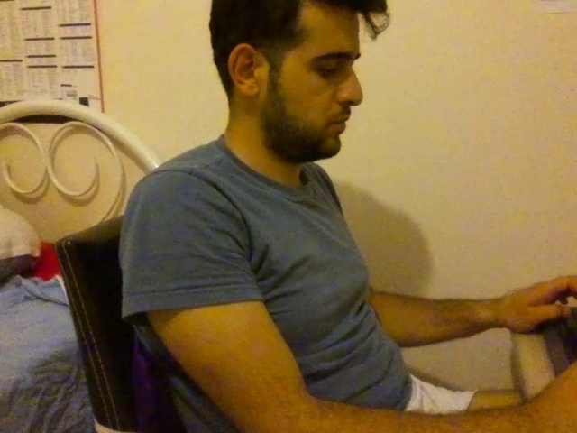

# Official YOLOv7

Implementation of paper - [YOLOv7: Trainable bag-of-freebies sets new state-of-the-art for real-time object detectors](https://arxiv.org/abs/2207.02696)


## Installation

Başlamak için Lütfen Okuyun !
<details><summary> <b>Expand</b> </summary>

``` shell
# 1
detect.pt dosyasını çalıştırmadan önce Tello Drone Kendi Pc niz ile Wifi baglantısu kurdugunuzdan emin olun !

# 2
e tuşu = TakeOff(Yerden Kaldırma) 

# 3
q tuşu = LannOff (Güvenli Yere İndirme)

```
    
   


</details>


On Tello Camera:
``` shell
python detect.py 
```

<div align="center">
    <a href="./">
        
    </a>
</div>


