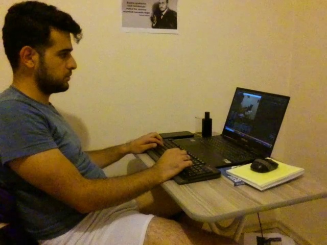

#  YOLOv7 Tello Drone Person Detection

Implementation of paper - [YOLOv7: Trainable bag-of-freebies sets new state-of-the-art for real-time object detectors](https://arxiv.org/abs/2207.02696)


## Installation

Başlamak için Lütfen Okuyun !
<details><summary> <b>Expand</b> </summary>

``` shell

Önemli: Başlamadan Önce Yolov7.pt dosyasını indirip ana klasöre kopyalanamınız gerekli !!!!!!
indirmek için:
    <a href="https://colab.research.google.com/gist/AlexeyAB/b769f5795e65fdab80086f6cb7940dae/yolov7detection.ipynb">


On Tello Camera:
``` shell
python detect.py 
```

<div align="center">
    <a href="./">
        
    </a>
</div>


